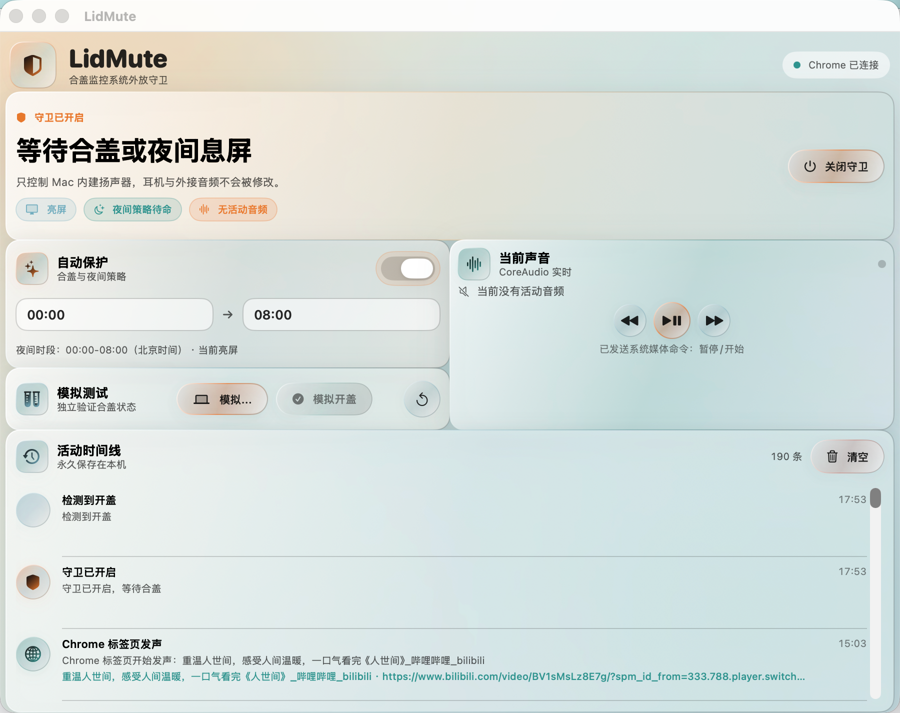

# LidMute

LidMute 是一款 macOS 菜单栏小工具。它会在 MacBook 合盖时守住内建扬声器，避免网页、通知或后台程序突然从电脑外放声音。

它只处理 Mac 的内建扬声器，不会影响蓝牙耳机、USB 声卡、显示器或 HDMI 音频设备。

## 预览



## 它能做什么

- **合盖时自动静音**：开启守卫后，MacBook 合盖期间如果内建扬声器可能发声，LidMute 会保持扬声器静音。
- **开盖后恢复状态**：结束保护时，恢复进入保护前的音量和静音状态。
- **菜单栏快速控制**：不必打开主窗口，直接从菜单栏开启或关闭守卫。
- **轻量模式**：隐藏主窗口和程序坞图标，只保留菜单栏入口，适合长期后台运行。
- **夜间保护**：可以设置夜间时段，在屏幕休眠后自动保护内建扬声器。
- **查看事件记录**：主窗口会记录合盖、开盖、静音和恢复等事件，方便确认 LidMute 是否正常工作。
- **定位 Chrome 发声标签页**：可选装配套 Chrome 扩展，记录正在发声的标签页名称和地址。

> LidMute 的最后一道保护是静音内建扬声器。它可能向系统发送暂停请求，但不能保证所有网页或播放器都会停止播放。

## 系统要求

- macOS 15 或更高版本
- MacBook（合盖保护功能需要笔记本电脑的合盖事件）
- 从源码安装时，需要先安装 Xcode Command Line Tools

## 安装

目前项目暂未提供经过 Apple 签名的安装包，需要从源码构建。只需在“终端”中依次运行下面的命令：

```zsh
xcode-select --install
git clone https://github.com/Hanjunrong/LidMute.git
cd LidMute
zsh Scripts/make-app-bundle.sh
open dist/LidMute.app
```

如果已经安装过 Xcode Command Line Tools，第一条命令可以跳过。构建完成后，应用位于 `dist/LidMute.app`，可以把它拖入“应用程序”文件夹。

首次打开时如果 macOS 提示无法验证开发者，请在 Finder 中右键点击 LidMute，选择“打开”，再确认一次。

## 使用方法

启动 LidMute 后，屏幕顶部菜单栏会出现它的图标。

1. 点击菜单栏图标。
2. 点击第一行的“开启守卫”。
3. 正常使用 Mac；合盖或进入已设置的夜间保护时段后，LidMute 会自动保护内建扬声器。
4. 不再需要保护时，点击同一位置的“关闭守卫”。

菜单第二行是“轻量模式”：

- 勾选后，主窗口和程序坞图标会隐藏，只保留菜单栏图标。
- 取消勾选后，主窗口和程序坞图标会恢复。
- 每次重新启动 LidMute 时，轻量模式默认关闭，不会自动勾选。

模拟合盖、模拟开盖、夜间时段和事件记录都在主窗口中。它们适合在不真正合盖的情况下检查保护是否生效。

## Chrome 标签页记录（可选）

不安装 Chrome 扩展也能使用合盖静音保护。扩展只用于帮助你确认是哪个 Chrome 标签页产生了声音。

需要使用时：

1. 在 LidMute 主窗口中打开 Chrome 扩展连接指南。
2. 按指南进入 `chrome://extensions`，开启“开发者模式”。
3. 加载 LidMute 提供的 `ChromeExtension` 文件夹。
4. 将 Chrome 显示的扩展 ID 填回 LidMute，并点击注册。
5. 刷新扩展，直到 LidMute 显示“Chrome 已连接”。

扩展只读取标签页标题、地址和是否发声等信息，记录保存在本机，不会上传到远程服务器。

## 常见问题

### 开启守卫后会立刻静音吗？

不会。开启守卫只是让 LidMute 进入待命状态；真实合盖、模拟合盖，或符合条件的夜间息屏场景才会触发保护。

### 会影响耳机或显示器声音吗？

不会。LidMute 只保护能明确识别出的 Mac 内建扬声器。无法确认设备类型时，它会放弃操作，避免误伤外接音频设备。

### 轻量模式下怎样找回窗口？

点击菜单栏中的 LidMute 图标，取消勾选“轻量模式”。

### LidMute 会把日志上传到网络吗？

不会。事件记录和 Chrome 标签页信息都保存在本机。

## 隐私与限制

- 不读取网页正文，不注入网页脚本，也不拦截网络请求。
- 不会主动结束浏览器或播放器进程。
- Chrome 标签页级记录依赖可选的 Chrome 扩展；其他浏览器只能显示系统能够识别到的进程级信息。
- 系统媒体暂停请求由 macOS 决定交给哪个播放器处理，因此静音保护仍是最终保障。

## 开源协议

本项目采用 [MIT License](LICENSE) 开源。你可以自由使用、修改和分发，但需要保留原始版权和许可声明。
