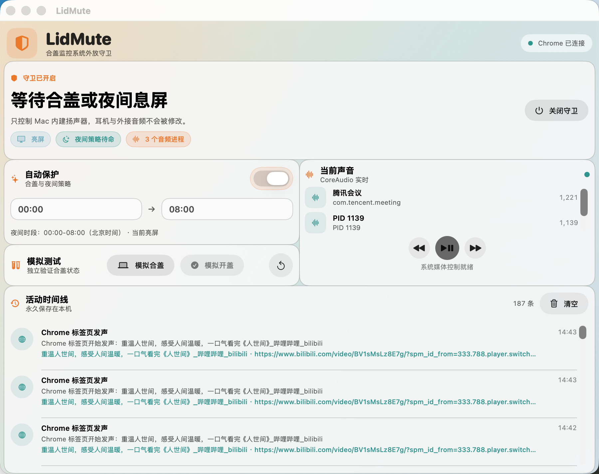

# LidMute

LidMute 是一款运行在 macOS 菜单栏中的轻量守卫应用，主要用于在合盖场景下保护内建扬声器的外放状态，并提供可追溯的本地事件记录。

## 界面预览



## 主要功能

- 合盖监控：检测 Mac 合盖状态，在守卫开启时根据状态执行静音保护。
- 状态栏控制：从菜单栏快速开启或关闭守卫，并切换轻量模式。
- 轻量模式：隐藏主窗口和程序坞图标，只保留状态栏入口，适合常驻后台使用。
- 模拟调试：在主界面里可模拟合盖和开盖，便于不关机、不真合盖地验证状态机。
- 夜间静音：支持按北京时间配置夜间时段，在屏幕休眠时自动保护扬声器。
- Chrome 音频桥接：配套 Chrome 扩展与 native host，可记录标签页标题、URL、窗口 ID、标签 ID 和 `audible` 变化，用于更准确地定位音频来源。
- 媒体控制：支持系统级上一首、下一首、播放/暂停控制。
- 本地时间线：记录守卫事件，便于回看每次触发和恢复过程。

## 界面说明

- 主窗口：用于查看当前守卫状态、音频来源、Chrome 连接状态、夜间静音配置和事件时间线。
- 状态栏菜单：提供“开启守卫 / 关闭守卫”、“轻量模式”和退出入口。

## 构建与打包

仓库使用项目内置打包脚本，不直接使用 `swift build` 作为最终交付方式。

```zsh
cd /Users/han/temp/workspace/LidMute
zsh Scripts/make-app-bundle.sh
```

打包后会生成 `dist/LidMute.app`。该脚本会先做视觉原则检查，再重新构建并打包，避免复用旧二进制。

## 运行

```zsh
CLANG_MODULE_CACHE_PATH=/tmp/lidmute-clang-cache \
swift run --disable-sandbox --scratch-path /tmp/lidmute-build LidMuteApp
```

如果要打开本地 `.app`：

```zsh
open dist/LidMute.app
```

## Chrome 扩展接入

1. 打开 `chrome://extensions`，开启开发者模式。
2. 加载仓库里的 `ChromeExtension` 目录。
3. 复制扩展 ID。
4. 运行注册脚本，把扩展和 native host 连接起来。

## 验证建议

- 启动后确认菜单栏入口可见。
- 开启守卫后，检查合盖和开盖流程是否按预期改变外放状态。
- 打开轻量模式后，确认窗口和 Dock 图标都隐藏。
- 关闭轻量模式后，确认主窗口恢复。
