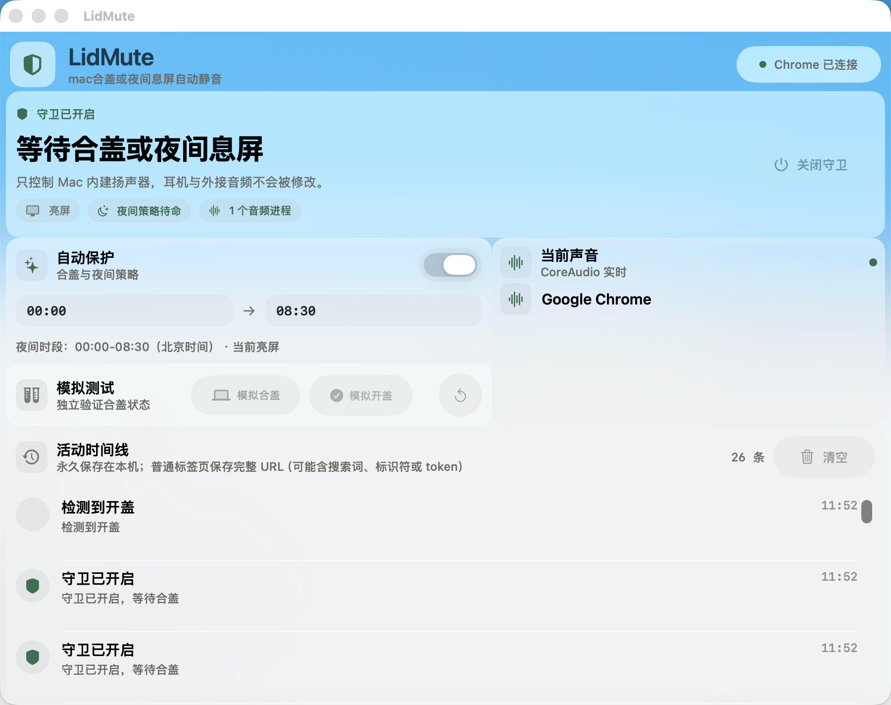

# LidMute

LidMute 是一款运行在 macOS 菜单栏中的轻量守卫应用，主要用于在合盖场景下保护内建扬声器的外放状态，并提供可追溯的本地事件记录。

## 界面预览



## 主要功能

- 合盖监控：检测 Mac 合盖状态，在守卫开启时根据状态执行静音保护。
- 状态栏控制：从菜单栏快速开启或关闭守卫，并切换轻量模式。
- 轻量模式：隐藏主窗口和程序坞图标，只保留状态栏入口，适合常驻后台使用。
- 模拟调试：在主界面里可模拟合盖和开盖，便于不关机、不真合盖地验证状态机。
- 夜间静音：支持按北京时间配置夜间时段，在屏幕休眠时自动保护扬声器。
- Chrome 音频桥接：配套 Chrome 扩展与 native host，可记录标签页标题、URL、窗口 ID、标签 ID 和 `audible` 变化，用于更准确地定位音频来源。
- 媒体控制：支持系统级上一首、下一首、播放/暂停控制。
- 本地时间线：记录守卫事件，便于回看每次触发和恢复过程。

## 界面说明

- 主窗口：用于查看当前守卫状态、音频来源、Chrome 连接状态、夜间静音配置和事件时间线。
- 状态栏菜单：提供“开启守卫 / 关闭守卫”、“轻量模式”和退出入口。

## 构建与打包

仓库使用项目内置打包脚本，不直接使用 `swift build` 作为最终交付方式。

```zsh
cd /Users/han/temp/workspace/LidMute
LIDMUTE_SIGNING_MODE=adhoc zsh Scripts/make-app-bundle.sh
```

打包后会生成 `dist/LidMute.app`。该脚本会先做视觉原则检查，再以 Release 配置重新构建并打包，避免复用旧二进制。默认/`adhoc` 产物只用于本机验收，没有经过 Apple 公证，不可作为公开发行包。

Developer ID 发行通道必须在已配置凭据的发行机器上提供完整且精确的 identity 和 `notarytool` 钥匙串 profile：

```zsh
LIDMUTE_SIGNING_MODE=developer-id \
LIDMUTE_DEVELOPER_IDENTITY='Developer ID Application: <名称> (<TEAMID>)' \
LIDMUTE_NOTARY_PROFILE='<已存在的 notarytool profile>' \
zsh Scripts/make-app-bundle.sh
```

每个 Developer ID 构建都强制启用 hardened runtime 与时间戳，并完成 Apple 公证和 stapling。identity、profile、公证或 stapling 任一步失败都会停止，绝不回退到 ad-hoc。版本更新只编辑 `Config/Version.plist`。

## 运行

```zsh
CLANG_MODULE_CACHE_PATH=/tmp/lidmute-clang-cache \
swift run --disable-sandbox --scratch-path /tmp/lidmute-build LidMuteApp
```

如果要打开本地 `.app`：

```zsh
open dist/LidMute.app
```

## Chrome 扩展接入

1. 打开 `chrome://extensions`，开启开发者模式。
2. 加载仓库里的 `ChromeExtension` 目录。
3. 复制扩展 ID。
4. 运行注册脚本，把扩展和 native host 连接起来。

“Chrome 已连接”表示 heartbeat 有效且不超过 6 秒；native host 每 2 秒刷新一次 heartbeat。移动 LidMute.app 后，manifest 中的 native host 路径可能失配，可在应用内点击“修复 Chrome 通信路径”，然后刷新扩展。

普通窗口中正在发声的标签页会把完整 URL 保存在本机，包括 query 与 fragment，其中可能包含搜索词、标识符或 token。隐身窗口的标签页级证据会被忽略，绝不持久化或写入日志。主界面的“清空”删除事件和标签页观察数据，但保留 Chrome 注册信息。

## 健康状态

- “当前没有活动音频”表示检查成功且当前没有发声来源，是健康状态。
- CoreAudio、合盖传感器与本地存储失败会分别显示，不会被归类为“没有活动音频”。
- Chrome 连接健康只由 2 秒刷新、最多 6 秒的新鲜 heartbeat 证明；陈旧 heartbeat 不代表仍连接。

## 验证建议

- 启动后确认菜单栏入口可见。
- 开启守卫后，检查合盖和开盖流程是否按预期改变外放状态。
- 打开轻量模式后，确认窗口和 Dock 图标都隐藏。
- 关闭轻量模式后，确认主窗口恢复。
- 公开发行前在真实 MacBook 上验证合盖/开盖和屏幕休眠，并切换内建、蓝牙/USB、显示器音频路由。
- 使用 Developer ID 产物在一台干净的 macOS 15 或更高版本机器上完成 Gatekeeper 验收。自动化测试和本地 ad-hoc 包不能替代这些步骤。

## 隐私边界

- 不读取网页正文，不注入网页脚本，也不拦截网络请求。
- 普通窗口发声标签页的完整 URL（包括 query 与 fragment）保存在本机，可能包含搜索词、标识符或 token。
- 隐身窗口的标题、URL、原始 frame 和标签页证据会被忽略，绝不持久化或记录到日志。
- “清空”删除观察数据，但保留 Chrome 注册。
